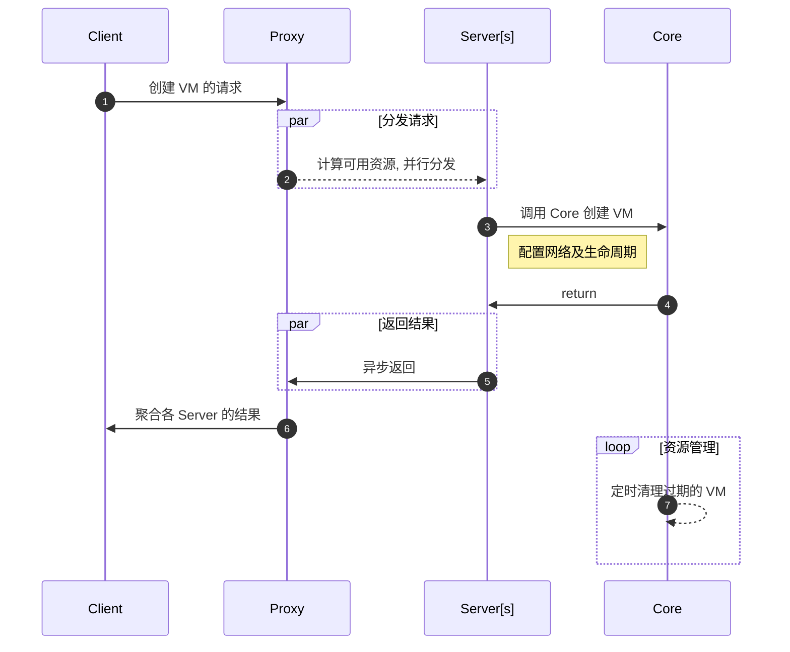
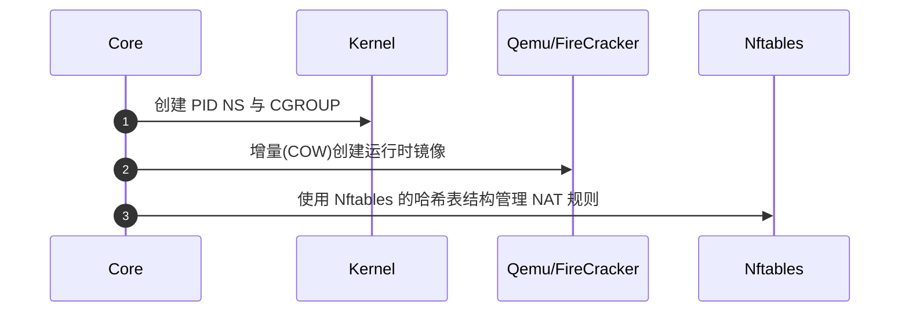

# System Design

## 架构说明

### 上层逻辑

TT 中的基本管理单位为 “环境(ENV)”, 如下以时序图的方式展现一个 “环境” 的创建过程.

### Core 内部实现

#### On Linux

## Why NOT

### Why NOT K8S

K8S 主要用于调度容器, 不适于对隔离性要求较高的场景.

### Why NOT OpenStack

OpenStack 太过复杂, 需要专门的团队维护, 成本太高.

### Why NOT Ansible

Ansible 只是一个批量管理工具, 不具备虚拟方案的管理与调度功能.

### Why NOT Libvirt

Libvirt 在安装系统及远程管理方面非常便捷, 但不具备自动化调度的能力. 当前 TT 系统使用 Libvirt 做为基础系统镜像的安装工具.
